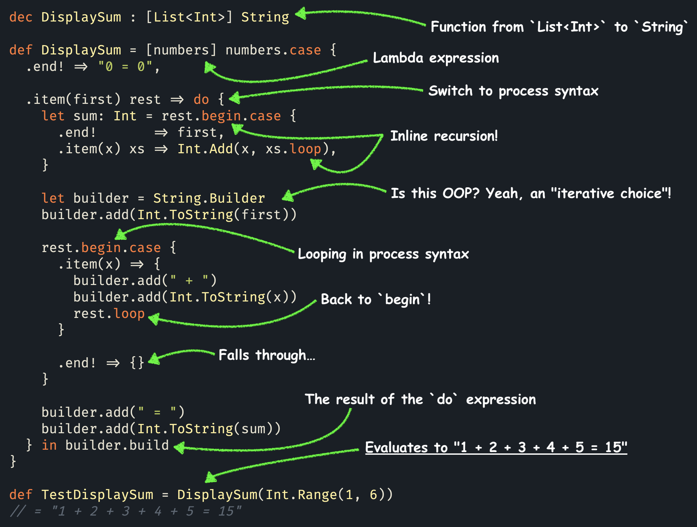

# **Par** is an _expressive, concurrent, total*_ language
## ...with linear types and duality

- 💬 **Join our [Discord](https://discord.gg/8KsypefW99),** or use the
  [Discussions](https://github.com/faiface/par-lang/discussions) as a forum to ask questions and share ideas!

- 🫶 If you'd like to support my effort to bring the power of linear logic into practical programming, you can do
  it via [GitHub Sponsors](https://github.com/sponsors/faiface).

- 🦀 If you like this **concurrent paradigm,** and want to use it **in a real programming language,** check out
  my Rust crate with the same name: **[Par](https://github.com/faiface/par).** It's a full implementation
  of **session types,** including non-deterministic handling of many clients.

## 🚀 Get started with the [documentation](https://faiface.github.io/par-lang/introduction.html)

## 💡 Check out the [examples](examples/)

# ✨ Features

## 🧩 Expressive

**Duality** gives two sides to every concept, leading to rich composability. Whichever angle you take to
tackle a problem, there will likely be ways to express it.
**Par comes with these first-class, structural types:**

_(Dual types are on the same line.)_

- [**Pairs**](https://faiface.github.io/par-lang/types/pair.html) (easily extensible to tuples), and [**functions**](https://faiface.github.io/par-lang/types/function.html) (naturally curried).
- [**Eithers**](https://faiface.github.io/par-lang/types/either.html) (sum types), and [**choices**](https://faiface.github.io/par-lang/types/choice.html) (unusual, but powerful dispatchers).
- [**Recursive**](https://faiface.github.io/par-lang/types/recursive.html) (finite), and [**iterative**](https://faiface.github.io/par-lang/types/iterative.html) (co-recursive, potentially infinite) types, with totality checking.
- [**Universally,**](https://faiface.github.io/par-lang/types/forall.html) and [**existentially**](https://faiface.github.io/par-lang/types/exists.html) quantified generic functions and values.
- [**Unit,**](https://faiface.github.io/par-lang/types/unit.html) and [**continuation.**](https://faiface.github.io/par-lang/types/continuation.html)

These **orthogonal concepts** combine to give rise to a rich world of types and semantics.

## 🔗 Concurrent

**Automatically concurrent execution.** Everything that can run concurrently, does! Sequential execution is
only enforced by data dependencies. It's as if everything was `async`, but nothing needs `await`.

Par compiles to [interaction combinators](https://core.ac.uk/download/pdf/81113716.pdf), which is the
basis for the famous [HVM](https://github.com/HigherOrderCO/HVM), and the
[Bend](https://github.com/HigherOrderCO/Bend) programming language.

**Structured concurrency with session types.** Session types describe concurrent protocols, almost like
finite-state machines, and make sure these are upheld in code. Par needs no special library for these.
Linear types _are_ session types, at least in their full version, which embraces duality.

## 🛡️ Total*

**No crashes.** Runtime exceptions are not supported, except for running out of memory.

**No deadlocks.** Structured concurrency of Par makes deadlocks impossible.

**(Almost) no infinite loops.\*** By default, recursion using `begin`/`loop` is checked for well-foundedness.

**Iterative (corecursive) types** are distinguished from **recursive types**, and enable constructing
potentially unbounded objects, such as infinite sequences, with no danger of infinite loops, or a need
to opt-out of totality.

_\*There is an escape hatch. Some algorithms, especially divide-and-conquer, are difficult or impossible
to implement using easy-to-check well-founded strategies. For those, `unfounded begin` turns this check
off. Vast majority of code doesn't need to opt-out of totality checking, it naturally fits its requirements.
Those few parts that need to opt-out are clearly marked with `unfounded`. They are the only places
that can potentially cause infinite loops._

## 📚 Theoretical background

Par is fully based on [linear logic](https://plato.stanford.edu/entries/logic-linear/). It's an attempt to
bring its expressive power into practice, by interpreting linear logic as _session types_.

In fact, the language itself is based on a little process language, called _CP_, from a paper called
[_"Propositions as Sessions"_](https://www.pure.ed.ac.uk/ws/portalfiles/portal/18383989/Wadler_2012_Propositions_as_Sessions.pdf)
by the famous Phil Wadler.

While programming in Par feels just like a programming language, even if an unusual one, its programs
still correspond one-to-one with linear logic proofs.

# 🤝 Come help us!

There's still so much to be done! If this project speaks to you, join us on
[Discord](https://discord.gg/8KsypefW99).

# 🫶 Support the project!

Par is currently funded by motivation alone. Only your support can make it viable long-term.
[Consider sponsoring.](https://github.com/sponsors/faiface)