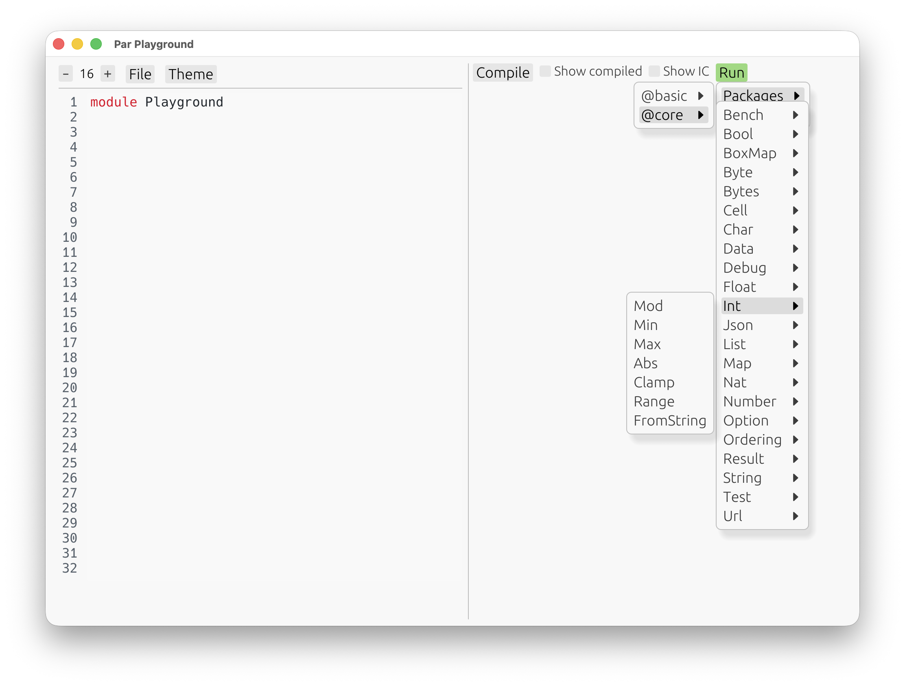

# Basic Program Structure

For now, _Par_ lacks a proper module system. Each program is contained in one file, with [built-in](TODO)
names imported automatically.

These built-in names are scoped in modules — for example, `Int.Add` is a function called `Add` in the
`Int` module — but there is no way to define custom modules. All we can do is define types and values,
and then run them, interactively!

Before we start defining our own types and values, the built-in definitions already give us something
to play with.

Let's open the playground!

```
$ par-lang playground
```

Press **Compile**, then hit the **Run** button:



All the built-in names are there. Let's run `Int.Add`:


An **automatic UI** shows up, telling us to input two numbers. After confirming both inputs,
we get a result:


The playground features an _automatic_ UI. Nobody made a specific interaface for this `Int.Add` function.
Instead, the UI that shows up is based purely on its type — here, a function from two integers to an
integer result.

Go ahead, and play with any built-in definition! Then, when you turn the page, we're going to talk about
creating our own.