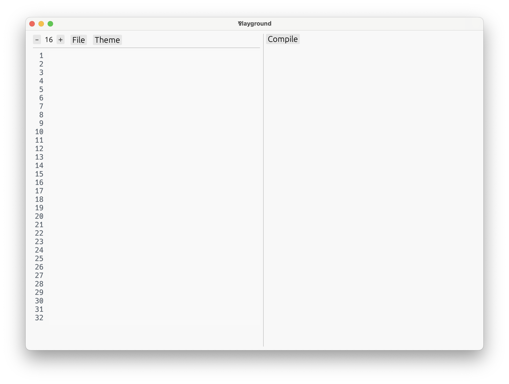

# Getting Started

Let's install the **Par** programming language. Currently, we have:
- A _playground_ to code and interactively explore your and built-in definitions via
  an _automatic UI._
- A _`run`_ command to run definitions with the [unit](./types/unit.md) type straight from
  the console.
- A _`check`_ command to check Par programs for validity without actually running them.

At the moment, there are no pre-built binaries, or releases, so we'll have to build it from
souce.

### 1. Install Rust and Cargo

Par is written in [Rust](https://www.rust-lang.org). To be able to build it from source,
we'll need to install Rust and its build tool, called Cargo.

The easiest way to do that is via [rustup](https://rustup.rs). The website instructs:

> Run the following in your terminal, then follow the onscreen instructions.
>
> ```
> $ curl --proto '=https' --tlsv1.2 -sSf https://sh.rustup.rs | sh
> ```

### 2. Clone Par's repository

The next step is to obtain Par's source code. That is located on
[GitHub](https://github.com/faiface/par-lang). Clone it locally by running the following
in your terminal:

```
$ git clone https://github.com/faiface/par-lang
```

### 3. Build and install Par's CLI tool

Navigate to the newly created directory:

```
$ cd par-lang
```

Then install the executable using Cargo:

```
$ cargo install --path .
```

This may take a while as Rust downloads and builds all the dependencies.

### 4. Try it out!

A new `par-lang` command should now be available in your terminal. It may be necessary
to restart the terminal for it to appear.

If successful, start the Par's playground:

```
$ par-lang playground
```

And the playground should appear:



If all is good, turn the page and **let's get into the language itself!**

In case of problems, head over to our [Discord](https://discord.gg/8KsypefW99), we'll try and
help.