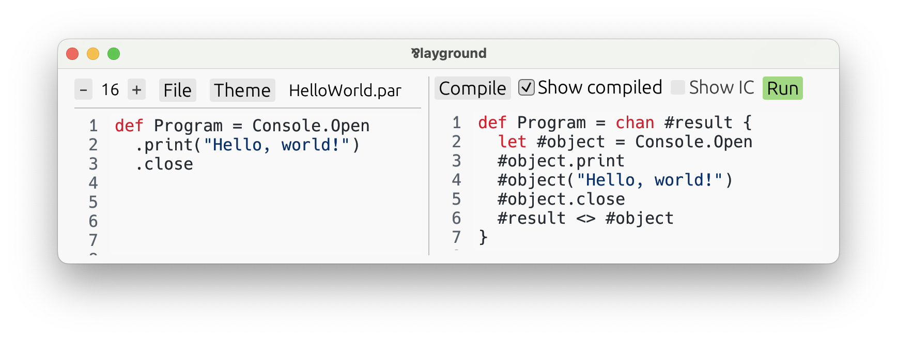

# The Process Syntax

So far, _Par_ seems clearly a functional language. Yes, it has linear types, and some unusual
features, like [choices](./types/choice.md), and `begin`/`loop` for
[recursive](./types/recursive.md) and [iterative](./types/iterative.md) types, instead of the
usual recursion by name. But, it's still clearly a functional language.

However, it is not! **At its core, Par is a _process language!_** While functional languages
are ultimately based on [_λ-calculus_](https://en.wikipedia.org/wiki/Lambda_calculus), Par is
based on _CP_, a process language similar to [_π-calculus_](https://en.wikipedia.org/wiki/Π-calculus).
Process languages are not based on expressions. Instead, they work with concurrent processes,
channels, and operations on them, like sending, and receiving. _CP_ was formulated by
[Phil Wadler](https://en.wikipedia.org/wiki/Philip_Wadler), an influential computer scientist,
in his wonderful paper called [_"Propositions as Sessions"_](https://www.pure.ed.ac.uk/ws/portalfiles/portal/18383989/Wadler_2012_Propositions_as_Sessions.pdf). It was not intended to become a basis
for a practical programming language; _GV_ — a functional language in the same paper — was supposed
to take that role. However, I saw much more potential in _CP_, and decided to turn it into
a practical language.

How is it then that Par managed to look perfectly functional until now? Turns out,
**all of the _construction_ and _destruction_ syntax described in [_Types & Their Expressions_](./types.md) can actually be considered a syntax sugar over the fundamental process syntax of Par**.

While most of the Par code you'll be writing will use _expression syntax_, the full power of the
language rests in the _process syntax_. There are things Par can express, which simply are not
expressible using the constructs we learned thus far.

## What Even Is a Process Language?

The most famous process language is undoubtedly [_π-calculus_](https://en.wikipedia.org/wiki/Π-calculus). In general, a process
language consists of:
- **Processes.** These are independent units of control flow, that execute concurrently, and interact by communication.
- **Channels.** That's where communication happens. Two processes that hold opposite ends of the same channel can use it
  to exchange information, or even other channels.
- **Commands.** Processes run by executing commands, those are their code. A command says what interaction to perform on a channel:
  what to send, what to receive.

From among these, we have already encountered one in Par: _channels_. That's because aside from
[primitives](./structure/strings_and_numbers.md), **all values in Par are channels.** Yes,
[functions](./types/function.md), [pairs](./types/pair.md), [choices](./types/choice.md), all of them. It will become much
clearer as we understand this process syntax.

Processes and commands have been more hidden, so far. They were always there, but not in a plain sight! Any expression, be
it a construction, or a destruction, compiled to processes composed of commands.

In fact, you can see it for yourself! Let's take any Par program, say `examples/HelloWorld.par`.

```par
def Program = Console.Open
  .print("Hello, world!")
  .close
```

Open it in the playground, press **Compile**, then enable the **✔️ Show compiled** checkbox:



What you see on the right is the same program rewritten using the most bare-bones process syntax that Par offers.
Aside from the `#`-signs in front of some variables (Par uses them for internally generated variables to avoid
name clashes), this is a valid Par program. If we remove those, we get this:

```par
def Program = chan result {
  let object = Console.Open
  object.print
  object("Hello, world!")
  object.close
  result <> object
}
```

Copy-paste it into the playground and run it! It's the same program.

## Isn't the expression syntax enough? Why complicate things?

First of all, it is in fact not enough. Not all Par programs are expressible using pure expression syntax, that we've learned
fully thus far.

But even more importantly, **process syntax can make your programs much nicer.** It's not a hammer to be used all the time!
Instead, it's a feature that has to be carefully combined with expression syntax and used when appropriate. Par offers syntax
features to **seamlessly switch between expressions and processes,** so that you can always apply that which fits best, granularly.

Sprinkles of process syntax tend to be a particularly good fit when dealing with [choices](./types/choice.md) and
[iteratives](./types/iterative.md). Take this function that zips two infinite sequences:

```par
type Sequence<a> = iterative choice {
  .close => !,
  .next => (a) self,
}

dec Zip : [type a, b] [Sequence<a>, Sequence<b>] Sequence<(a, b)!>
def Zip = [type a, b] [seq1, seq2] begin case {
  .close =>
    let ! = seq1.close in
    let ! = seq2.close in !,

  .next =>
    let (x) seq1 = seq1.next in
    let (y) seq2 = seq2.next in
    ((x, y)!) loop,
}
```

It takes two sequences, one of `a`s and one of `b`s, and produces a new sequence of pairs `(a, b)!`. When asked to close, it
closes the two underlying sequences as well — it must, they are linear. When asked for the next item, it polls both sequences
for their respective items and yields a pair of that.

It works, and is understandable. But, it can be even better, when we apply some process syntax!

```par
dec Zip : [type a, b] [Sequence<a>, Sequence<b>] Sequence<(a, b)!>
def Zip = [type a, b] [seq1, seq2] begin case {
  .close => do {
    seq1.close
    seq2.close
  } in !,

  .next => do {
    seq1.next[x]
    seq2.next[y]
  } in ((x, y)!) loop,
}
```

It might not look better on the first sight, due to unfamiliarity. But notice, this version is much less cluttered. Instead
of explicitly re-assigning `seq1` and `seq2`, we simply command them to give us their items. They automatically update in-place.

Here's where [**session types**](https://en.wikipedia.org/wiki/Session_type) come in. We now treat `seq1` as a channel. First,
we notify it of our intention with the `.next` signal. Then, we receive an item and save it to a variable with `[x]`. The
resemblance to the [construction syntax of functions](./types/function.md#construction) is not a coincidence!

**Now, let's learn what this process syntax is all about!** We'll start by gradually enriching our programs with some commands,
all the way to unlocking the full semantics of Par by exploiting **duality.**