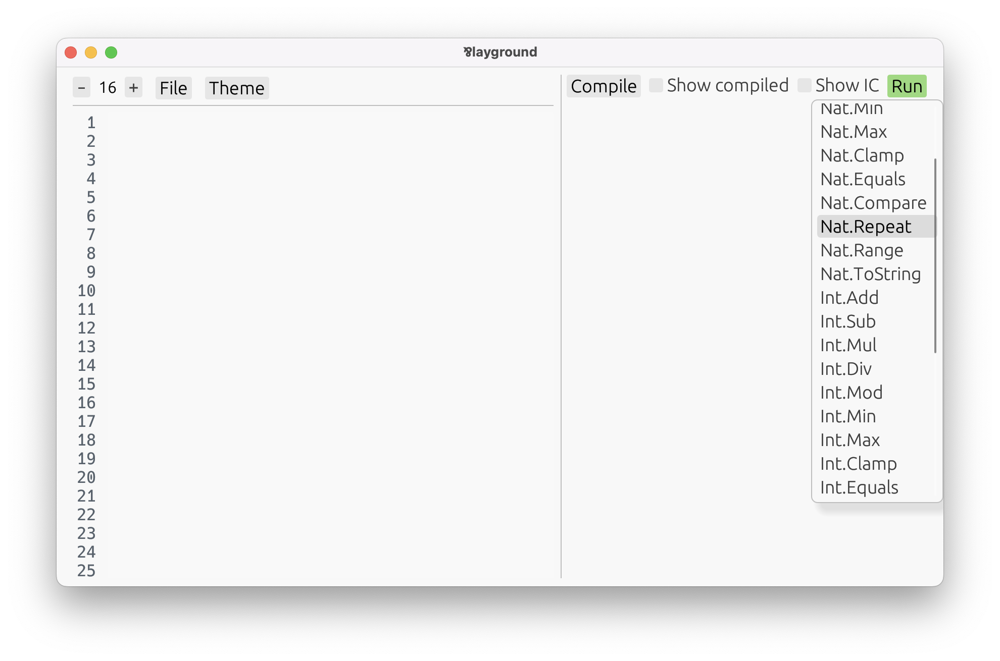
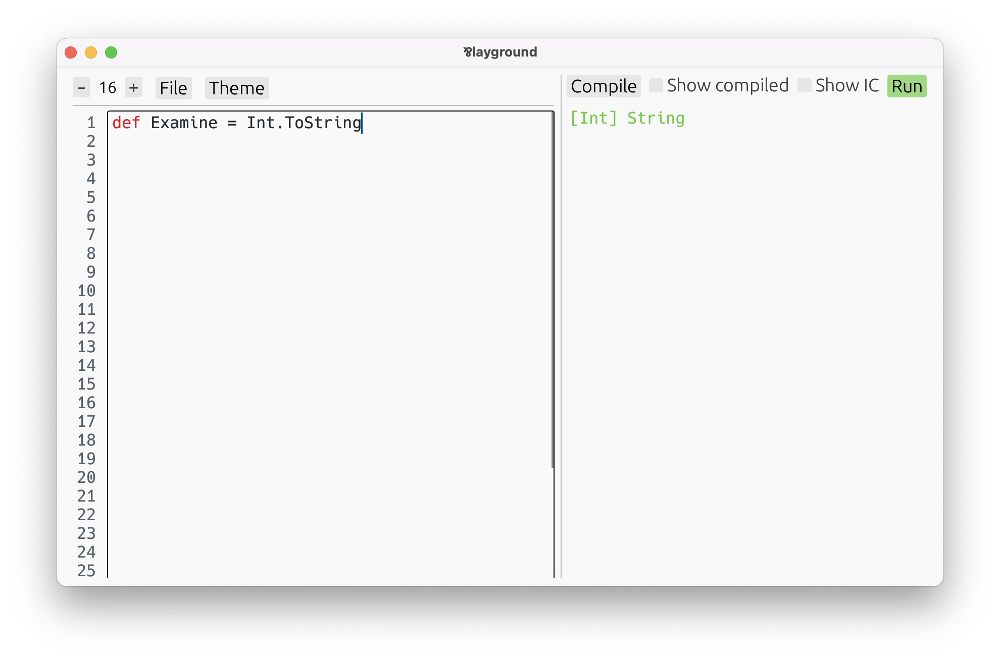

# Primitive Types

Before taking a stroll in the diverse garden of Par's types, let's stop by the most basic ones:
the _primitives._

At the moment, Par has six primitive types:
- **`Int`** — Integers, positive and negative whole numbers, arbitrary size.
- **`Nat`** — Natural numbers, starting from zero, arbitrary size. They are a subtype of `Int`.
- **`String`** — UTF-8 encoded sequence of Unicode characters.
- **`Char`** — Singular Unicode character.
- **`Byte`** — Singular data unit that consists of eight bits. They are a subtype of `Bytes`.
- **`Bytes`** — Contiguous-in-memory sequence of bytes.

> There's a **significant distinction** between _primitives_ and all other types in Par.
>
> The thing is, Par has a fully structural type system. All custom type definitions are just
> aliases — there is no way to create opaque types. _(But, encapsulation is perfectly possible.)_
>
> Primitives are different in that they are opaque. They are magical types, distinct from others,
> that are operated on using magical built-in functions. This is necessary to achieve their
> efficient representation.

Primitives are manipulated using magical built-in functions.

**To find the list of all built-in functions:**

1. Open the playground.
   ```
   $ par-lang playground
   ```
2. Press **Compile,** and **Run.** Scroll the list that pops up.
   

Alternatively, the [Built-In Definitions](../builtin.md) chapter contains all built-in definitions
available in the language.

**To figure out the type of a built-in function:**

1. Assigning it to your own `def`, such as:
   ```par
   def Examine = Int.ToString
   ```
   Par knows the type of `Int.String`, so it will infer it for `Examine` as well.
2. Press **Compile.**
3. Move the cursor to the definition. The playground will display the type on the right,
   in green.
   

The type `[Int] String` is a [function](../types/function.md) from `Int` to `String`. We will cover
functions and other types in detail [later](../types.md). Despite that, we'll still play with
some built-in functions in this section. All you need to know is that
**the square brackets enclose function arguments,** and the result type follows. For example:
- `[Int, Int] Int` is a function from two `Int`s to an `Int`.
- `[Int, Nat, Nat] Nat` is a function from one `Int` and two `Nat`s to a `Nat`.

> **The current set of built-in functions is very minimal.** They're just enough to be able to
> write more useful functions yourself, but they're nowhere close to a standard library. For example,
> there are no functions for analyzing strings, aside from `String.Reader`, which is flexible enough
> to implement all you'd need. You just need to do it yourself.
>
> Keep in mind that Par is early in development. It's bringing an innovative paradigm, which we're
> still figuring out how to use best. Creating an expansive standard library would be premature
> before we understand what's actually going on here.

Now, let's take a look at the primitives!

## `Int`

Integers are arbitrarily sized whole numbers, positive or negative.

Their literals consist of digits, optionally prefixed with `-` or `+`, and may include underscores
for readability.

```par
def Num1: Int = 7
def Num2: Int = -123_456_789
```

The type annotations are not needed:

```par
def Num3 = 42
def Num4 = -2202
```

Without annotations, `Num3` actually gets inferred as `Nat`. But, since `Nat` is a
subtype of `Int`, it can be treated as an `Int` too.

Built-in functions are used for arithmetic operations. For example:

```par
def Num5 = Int.Add(3, 4)  // = 7
def Num6 = Int.Mul(3, 4)  // = 12
```

Go ahead and explore more of them in the playground!

## `Nat`

Natural numbers are just integers excluding the negative ones. `Nat` is a subtype of `Int`, so
every variable of type `Nat` can be used as an `Int`, too.

```par
def Num7 = 14  // inferred as `Nat`
def Num8 = 17  // inferred as `Nat`

// perfectly valid
def Num9 = Int.Add(Num7, Num8)
```

While `Num7` and `Num8` are inferred as `Nat`s, `Num9` will be an `Int` because that's what
`Int.Add` returns. To get a `Nat` result, use `Nat.Add`, which only accepts `Nat`s:

```par
def Num10 = Nat.Add(Num7, Num8)  // inferred as `Nat`
```

**Several built-in functions aid in converting `Int`s to `Nat`s.** For example:
- **`Nat.Max`** has type `[Nat, Int] Nat` — the second argument is allowed to be an `Int`.
  Yet it's guaranteed to return a `Nat`.
- **`Int.Abs`** has type `[Int] Nat` — an absolute value is always a `Nat`.

```par
def Num11: Nat = Nat.Max(0, -1000)  // = 0
def Num12: Nat = Int.Abs(-1000)     // = 1000
```

Unlike `Int`s, natural numbers can be looped on using `Nat.Repeat`, which is one of their main
uses. We'll learn more about that in the section on [recursive](../types/recursive.md) types.

## `String`

Strings are represented as UTF-8 encoded sequences of Unicode characters. Their literals are
enclosed in double quotes (`"`), and may contain escape sequences, such as `\n`, familiar from
other languages.

```par
def Str1 = "Hello"  // inferred as `String`
def Str2 = "World"
```

To concatenate strings, use `String.Builder`. To fully understand how it works, we'll need to
cover [iterative](../types/iterative.md) and [choice](../types/choice.md) types, but perhaps
you can get the idea:

```par
def Str3 = String.Builder
  .add(Str1)
  .add(", ")
  .add(Str2)
  .build  // = "Hello, World"
```

Analyzing strings — such as finding, splitting, or parsing — is done using `String.Reader`.
To be able to use it, more knowledge of the language is needed first. But, feel
free to play with it in the playground, or check out the `StringManipulation.par` example in
the `examples/` folder.

Numbers can be converted to strings using `Int.ToString`:

```par
def Str4 = Int.ToString(14)  // = "14"
def Str5 = Int.ToString(-7)  // = "-7"
```

Note, that `Nat` is a subtype of `Int`, so any natural number can also be converted to a string
this way, too. In fact, that's exactly what happens with `Str4`.

## `Char`

A `Char` is a single Unicode character. `Char` literals are enclosed in single quotes:

```par
def Char1 = 'a'  // inferred as `Char`
def Char2 = '\n'
```

There's a built-in function to check if a `Char` is a part of a character class:

```par
def IsWhitespace = Char.Is(' ', .whitespace!)  // = .true!
```

There's no built-in function turning a `String` to a list of `Char`s. Feel free to
copy-paste this one, if you ever need it:

```par
dec Chars : [String] List<Char>
def Chars = [s] String.Reader(s).begin.char.case {
  .end _ => .end!,
  .char(c) rest => .item(c) rest.loop,
}
```

## `Byte`

A byte consists of eight bits, whose numerical value can range from 0 and 255, inclusive. `Byte`
literals are written in decimal, enclosed in double angle brackets:

```par
def Byte1 = <<65>>   // inferred as `Byte`
def Byte2 = <<321>>  // out-of-bounds values are automatically wrapped
```

Since `Byte` is a subtype of `Bytes`, every variable of type `Byte` can be used as a `Bytes`, too.

Just like `Char`s, there's a built-in function to check if a `Byte` is a part of a byte class. For `Byte`s, that's mainly byte ranges:

```par
def IsMsbSet = Byte.Is(<<192>>, .range(<<128>>, <<255>>)!)  // .true!
```

## `Bytes`

`Bytes` are sequences of zero or more bytes, laid out contiguously in memory in order to take the least possible amount of space. Their literals are similar to those of `Byte`s, except
that multiple decimal values are allowed, and are delimited by spaces:

```par
def Bytes1 = <<65 91>>  // inferred as `Bytes`
def Bytes2 = << >>      // zero-byte sequence
// def Bytes3 = <<>>    // This triggers syntax error for now, but we intend to fix it
```

A `Bytes` can also be broken down to a list of `Byte`s:

```par
dec Bytes : [Bytes] List<Byte>
def Bytes = [bs] Bytes.Reader(bs).begin.byte.case {
  .end _ => .end!,
  .byte(b) rest => .item(b) rest.loop,
}
```
